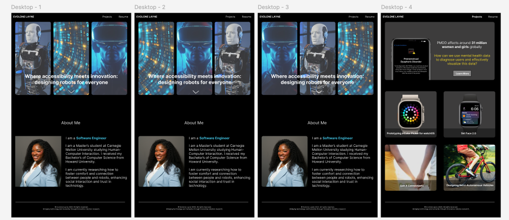

<mark>**Note that this document order from FP4 -> FP1**</mark>

<mark>Please sign up for the study</mark> at [https://tinyurl.com/pui-study](https://tinyurl.com/pui-study) to allow us to use your submission to create a better GenAI assistant for designers!

---

# **FP4 \- Final Project Writeup**

Feel free to refer to this [Markdown Cheat Sheet](https://www.markdownguide.org/cheat-sheet/) to make your writeup more organized, and you can preview your markdown file in VSCode [Markdown editing with Visual Studio Code](https://code.visualstudio.com/docs/languages/markdown#_markdown-preview). 

## Part 1: Website Description

Describe your website (300 words).

* What is the purpose of your website?   
* Who is the target audience?  
* What information do you convey with your website?   
* How is it interesting and engaging? 

## Part 2: User Interaction

How a user would interact with your website? For each step, briefly but clearly state the interaction type & how we should reproduce it.

1. Interaction type. Click on X on page Y / scroll on page X, etc.  
2. 

## Part 3: External Tool

Describe what important external tool you used (JavaScript library, Web API, animations, or other). Following the bulleted list format below, reply to each of the prompts.

1. Name of tool1  
   * Why did you choose to use it over other alternatives? (2 sentences max)  
   * How you used it? (2 sentences max)  
   * What does it add to your website? (2 sentences max)  
2. Name of tool2

## Part 4: Design Iteration

Describe how you iterated on your prototypes, if at all, including any changes you made to your original design while you were implementing your website and the rationale for the changes. (4-8 sentences max)

## Part 5: Implementation Challenge

What challenges did you experience in implementing your website? (2-4 sentences max)

## Part 6: Generative AI Use and Reflection

Describe how you used Generative AI tools to create this final project (fill in the following information, write \~500 words in total).

Document your use of all GenAI tools — ChatGPT, Copilot, Claude, Cursor, etc. using the template below. Add/Delete rows or bullet points if needed, and replace Tool1/Tool2 with the name of the tool.

### Usage Experiences by Project Aspects

Feel free to edit the column \_ (other?) or add more columns if there's any other aspect in your project you've used the GenAI tools for.

For the following aspects of your project, edit the corresponding table cell to answer:
- *Usage*: Whether you used / did not use this tool for the aspect. Enter [Yes/No]
- *Productivity*: Give a rating on whether this tool makes your productivity for X aspect [1-Much Reduced, 2-Reduced, 3-Slightly Reduced, 4-Not Reduced nor Improved, 5-Slightly Improved, 6-Improved, 7-Much Improved].

| Tool Name | Ratings | design | plan | write code | debug | \_ (other?) |
| :---- | :---- | :---- | :---- | :---- | :---- | :---- |
| Tool1 | Usage | Yes/No | Yes/No | Yes/No | Yes/No | Yes/No |
| Tool1 | Productivity | 1~7 | 1~7 | 1~7 | 1~7 | 1~7 |
| Tool2| Usage | Yes/No | Yes/No | Yes/No | Yes/No | Yes/No |
| Tool2 | Productivity | 1~7 | 1~7 | 1~7 | 1~7 | 1~7 |

### Usage Reflection

> Impact on your design and plan 
* It matched my expectations and plan in [FP2](#generative-ai-use-plan) in that … For example, 
  1. Tool1: 
  2. Tool2:
* It did not match my expectations and plan in [FP2](#generative-ai-use-plan) in that … For example, 
  1. Tool1: 
  2. Tool2:
* GenAI tool did/did not influence my final design and implementation plan because … For example, 
  1. Tool1: 
  2. Tool2:

> Use patterns
* I accepted the generations when …  For example, 
  1. Tool1: this tool once suggested … and I adjusted my design according to the suggestion because … 
  2. Tool2: 
* I critiqued/evaluated the generated suggestions by … For example, 
  1. Tool1: this tool once suggested … but I modified/rejected the suggestion because … 
  2. Tool2: 

> Pros and cons of using GenAI tools
* Pros
  1. Tool1: 
  2. Tool2:
* Cons
  1. Tool1: 
  2. Tool2:

### Usage Log

Document the usage logs (prompts and chat history links) for the GenAI tools you used. Some tools may not have an easy way to share usage logs, just try your best! Some instructions for different tools:

1. [ChatGPT](https://help.openai.com/en/articles/7925741-chatgpt-shared-links-faq) / [Gemini](https://support.google.com/gemini/answer/13743730?hl=en&co=GENIE.Platform%3DDesktop): share the anonymous link to all of your chat histories relevant to this project
2. [GitHub Copilot (VSCode)](https://code.visualstudio.com/docs/copilot/copilot-chat#:~:text=You%20can%20export%20all%20prompts%20and%20responses%20for%20a%20chat%20session%20in%20a%20JSON%20file%20with%20the%20Chat%3A%20Export%20Session...%20command%20(workbench.action.chat.export)%20in%20the%20Command%20Palette.): export chat histories relevant to this project.

---

# **FP3 \- Final Project Check-in**

Document the changes and progress of your project. How have you followed or changed your implementation & GenAI use plan and why? Remember to commit your code to save your progress.

## Implementation Plan Updates

- [ ] ...

## Generative AI Use Plan Updates

- [ ] ...

Remember to keep track of your prompts and usage for [FP4 writeup](#part-6-generative-ai-use-and-reflection).

---

# **FP2 \- Evaluation of the Final project**

## Project Description

I want to code a portfolio for my programming class because I need a central place to showcase my work and technical skills. Since I'm applying to a PhD program in a scientific field, having a professional portfolio would be a huge asset for sharing my research, projects, and technical experience with potential advisors and admissions committees. Right now, I don’t have an online portfolio, and creating one would allow me to present my work in a polished, organized way.

This portfolio will also be critical for future internships and full-time roles, especially in tech areas where demonstrating hands-on experience is essential. Building it will give me the opportunity to practice front-end development and design, ensuring I have a high-quality, professional site to represent my skills and experience.

## High-Fi Prototypes

### *Prototype 1*

A brief description and summary of the user feedback (\<100 words, 2 images) 

### *Prototype 2*

…

## Usability Test

Discuss the user feedback you got during the evaluation / usability test (\~300 words). Indicate which feedback you implemented, inspired new directions, or otherwise influenced your final design. 

## Updated Designs

Show screenshots of your updated design based on the user feedback (\<100 words, \~2 images).

## Feedback Summary

Summarize the feedback you received in the lab session and discuss how it influenced your design (\~300 words). 

## Milestones

Outline weekly milestones to plan your expected implementation progress until the end of the semester (\~300 words). 

### *Implementation Plan*

- [ ] Week 9 Oct 28 \- Nov 1:
  - [X] FP1 due
  - [ ] ...
  
- [ ] Week 10 Nov 4 \- Nov 8:   
  - [ ] FP2 due

- [ ] Week 11 Nov 11 \- Nov 15:  
- [ ] Week 12 Nov 18 \- Nov 22:   
- [ ] Week 13 Nov 25 \- Nov 29:  

  - [ ] Thanksgiving  
- [ ] Week 14 Dec 2 \- Dec 6:  
  - [ ] FP4 due 

### *Libraries and Other Components*

List the JS libraries and other components (if applicable) that you plan to use. 
* 

## Generative AI Use Plan

Outline how you plan to use Generative AI tools to aid in the implementation (\~300 words).

### *Tool Use*

 What would you use? Edit the list given your plan. For each tool, explain briefly on what do you expect Generative AI to help you with and what might it not be able to help you with.

* ChatGPT  
  * I will use it for … because it can help me …  
  * I will not use it for … because it might not be able to help me with …   
* GitHub Copilot  
* ...

### *Responsible Use*

How would you use Generative AI responsibly? 

---
# **FP1 \- Proposal for Critique**

## Idea Sketches

### _Idea 1_

**What is the basic idea of your final project?**  
I plan a portfolio to make myself competitive for design roles.

**How do you plan to make your design interactive and engaging?**  
I plan to add microinteractions to show that buttons are clickable. Potentially adding live demos would be a stretch goal.

**How do you plan to make your design accessible?**  
I plan to add alt text to make sure the user knows what they are interacting with. I can also attempt to add live demos of my projects.

**What information do you specifically want to convey and include on your website?**  
I want to showcase my projects and skills. I basically want an interactive resume.

### _Idea 2_

**What is the basic idea of your final project?**  
I want to introduce users to other fields in tech outside of software engineering.

**How do you plan to make your design interactive and engaging?**  
I want them to take a quiz that can match them to the field they can look into.

**How do you plan to make your design accessible?**  
Since a lot will be going on, adding focus indicators will help the user to complete tasks without getting distracted.

**What information do you specifically want to convey and include on your website?**  
I want to display the different fields and resume tips to increase the likeliness of getting properly placed in the tech field.

### _Idea 3_

**What is the basic idea of your final project?**  
I want to help users pick a movie to watch when they can't decide.

**How do you plan to make your design interactive and engaging?**  
I plan to have the users answer a series of questions that will lead to an accurate movie suggestion based on API parameters.

**How do you plan to make your design accessible?**  
Using semantic elements and adding alt-text will help make the design more accessible. Also, adding highly contrasting colors will make the text legible.

**What information do you specifically want to convey and include on your website?**  
I want users to learn about movies they would've never considered before taking the quiz on the website.

## Feedback Summary

In my recent portfolio lab session, I received valuable feedback on enhancing the user experience and visual design across multiple sections. Starting with the Home Page, it was recommended that I incorporate more microinteractions to make the experience feel dynamic and responsive. These subtle animations can guide user actions and create a more engaging first impression. Additionally, shifting towards illustrative storytelling and using fewer words could help communicate my narrative more effectively and capture users’ attention quickly.

On the Resume Page, feedback focused on improving visual hierarchy to better direct the viewer’s eye. This could involve experimenting with typography, spacing, or color contrasts that guide users naturally from one section to another. Instead of traditional company logos, using team icons or simplified visuals could create a clean, cohesive look while still conveying my experience. Adding a “Download PDF” button was also suggested to provide easy access for users who want to view my resume offline.

For the Projects section, suggestions included making the page more interactive, encouraging users to engage with my work actively. This could mean implementing hover effects, interactive elements, or embedded prototype previews that offer a hands-on experience. Additionally, I was encouraged to find ways to maintain user interest, such as adding tooltips or brief descriptions to explain each project’s context and unique challenges. To address potential NDA restrictions, it may be wise to consider password-protected sections to securely display work without violating confidentiality agreements.

Finally, for the Accomplishments section, I received advice to rethink the layout to improve alignment and readability. Using a grid with rectangles or squares could provide a structured, visually appealing format that’s easier for users to scan and absorb information quickly. By implementing these changes, I can create a portfolio that feels polished, interactive, and tailored to my audience’s experience.

___

For the website prototype focused on tech fields and resume help, I received some insightful feedback on the Resume Page. Some users felt that the checklist format for resume tips made the experience feel rigid and passive. They suggested transforming it into a more interactive experience, possibly by guiding users through personalized steps, such as tips tailored to different resume sections or interactive prompts that encourage users to add their own inputs along the way. Additionally, many noted that the background stars should be animated, creating a dynamic effect to immerse users and visually represent the “journey” of career building. This subtle, moving backdrop could add depth to the page, helping users feel more engaged as they explore the content. Overall, these recommendations focus on making the Resume Page both interactive and visually captivating to enhance the learning experience.

___

For the movie suggestions site that prompts users with questions to recommend films, I received valuable feedback regarding both the visual design and overall user experience. A key critique was to change the color theme from orange to something more inviting and warm, as users felt the current palette was a bit harsh and not conducive to a relaxed browsing experience. Suggestions included using softer colors or a more vibrant combination that evokes a sense of fun and excitement.

Additionally, users noted that the site felt somewhat plain and could benefit from more engaging elements. They recommended exploring ways to make the interface more interactive and enjoyable, such as incorporating playful animations, dynamic transitions, or even thematic visuals that relate to the movies being suggested. Enhancing the overall aesthetics and interactivity of the site will not only make it more visually appealing but also create a more enjoyable experience for users as they navigate through movie recommendations. By implementing these changes, I aim to foster a more inviting atmosphere that encourages users to explore and discover new films.

## Feedback Digestion

In my recent portfolio lab, I received feedback focused on enhancing interactivity, visual storytelling, usability, and layout. A key suggestion was to incorporate more microinteractions on the Home Page to make the experience feel lively and guide users naturally through the content. This subtle interactivity can significantly improve user engagement, so I plan to add these in my next design. For instance, I might use animations when hovering over elements or smooth transitions between sections, as these details can elevate the overall user experience without overwhelming the page.

The idea of implementing illustrative storytelling was another valuable critique. This would involve visually conveying my narrative rather than relying heavily on text. I see the potential of incorporating illustrations to highlight specific project insights and personal experiences, making my portfolio more memorable and approachable. Since reducing text aligns with this approach, I’ll work to replace some descriptive content with visuals that communicate effectively on their own.

Adding a “Download PDF” button on the Resume Page was also recommended, to give users easy access to my resume in a downloadable format. This feature enhances convenience for viewers, especially recruiters who might want to save my resume directly. Given its practical value, I’ll prioritize this addition in my upcoming design update.

Finally, feedback on the Accomplishments page layout suggested switching to a grid of rectangles or squares for better alignment and readability. While I see the merit in a structured grid, I’d like to explore hybrid layouts first to balance visual appeal with functionality. I’ll test a few formats and gather feedback to ensure the design remains easy to navigate.

In summary, I’ll prioritize microinteractions, illustrative storytelling, and the PDF download button, as these adjustments should enhance usability and overall presentation. I’ll approach the layout revision thoughtfully to maintain both structure and creativity.

---

For the website prototype focused on tech fields and resume help, the feedback highlighted the need for a more interactive and engaging Resume Page. Users expressed that the current checklist format felt too rigid, suggesting a shift towards a more dynamic experience. Implementing personalized steps for resume building, such as tailored tips for different sections, could enhance user engagement and encourage active participation. Additionally, incorporating interactive elements—like prompts for users to input their own information—would create a more hands-on learning experience. Another suggestion was to animate the background stars, which could add visual interest and create an immersive atmosphere, making the content more engaging for users. These changes aim to transform the Resume Page into a lively, user-centric space that fosters deeper interaction and learning.

---

For the movie suggestions site, users recommended changing the color theme from orange to a more inviting and warm palette to create a more relaxed browsing experience. A softer color scheme could help evoke a sense of fun and excitement, making the site feel more welcoming. Additionally, feedback pointed out that the site appeared plain and could benefit from more engaging design elements. Suggestions included incorporating playful animations, dynamic transitions, and thematic visuals that relate to the movies being suggested. By implementing these changes, the goal is to enhance the visual appeal and overall user experience, encouraging users to explore and enjoy discovering new films in a more inviting environment.
