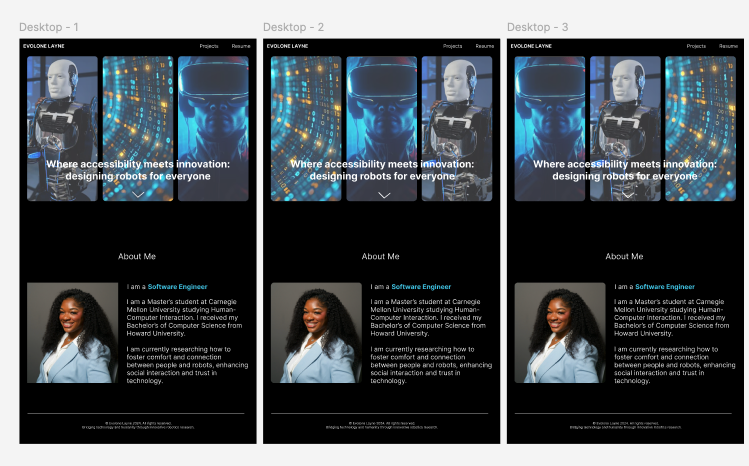
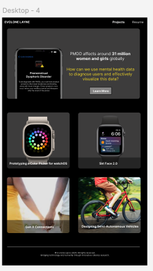
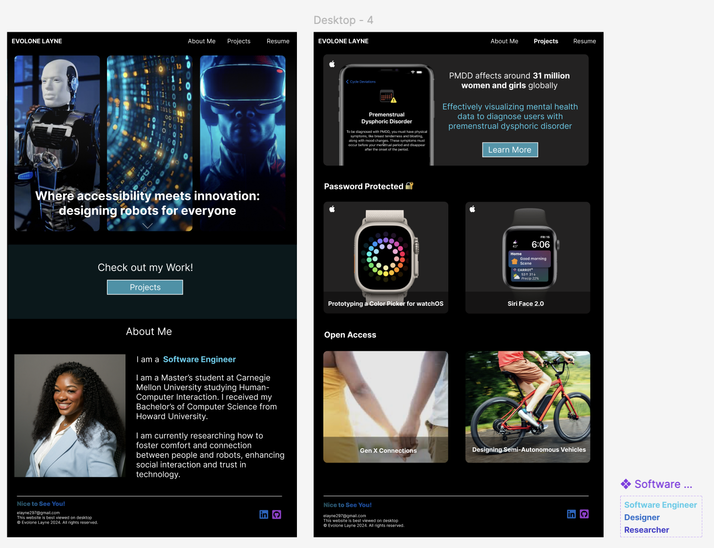
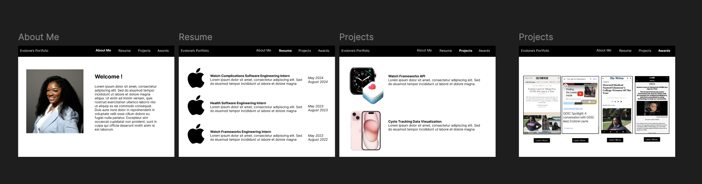
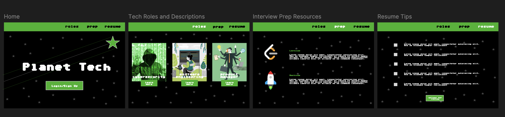
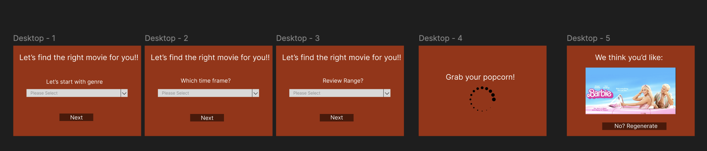

<mark>**Note that this document order from FP4 -> FP1**</mark>

<mark>Please sign up for the study</mark> at [https://tinyurl.com/pui-study](https://tinyurl.com/pui-study) to allow us to use your submission to create a better GenAI assistant for designers!

---
## **FP4 \- Final Project Writeup**

Feel free to refer to this [Markdown Cheat Sheet](https://www.markdownguide.org/cheat-sheet/) to make your writeup more organized, and you can preview your markdown file in VSCode [Markdown editing with Visual Studio Code](https://code.visualstudio.com/docs/languages/markdown#_markdown-preview). 

## Part 1: Website Description

# **Describe your website (300 words).**
My portfolio website is an interactive and responsive platform designed to showcase my professional skills, academic background, and innovative projects. The purpose of the website is to provide a comprehensive overview of my expertise in software engineering, design, and research, while also creating a visually appealing and engaging user experience. It serves as a digital representation of my professional brand, intended to attract potential employers, collaborators, and mentors.

The website includes several key sections, each meticulously designed to convey specific information. The "About Me" section introduces my educational background and research interests, highlighting my current focus on human-computer interaction and the development of accessible technologies. It also features a dynamic role-changing animation to add a personal and interactive touch.

The "Projects" section showcases significant academic and personal projects, such as innovative mental health visualizations and color picker prototypes. Each project is presented with detailed descriptions, images, and links to explore further, ensuring clarity and engagement.

Additionally, the "Resume" section provides a downloadable version of my professional CV, enabling quick access for recruiters. The website is connected to external profiles, such as GitHub and LinkedIn, ensuring seamless navigation for visitors seeking more in-depth information or collaboration opportunities.

The website’s design emphasizes accessibility and responsiveness, offering a consistent and user-friendly experience across devices. Vibrant colors, smooth transitions, and a clean layout enhance the website's visual appeal while ensuring optimal readability. The site is structured to engage users through intuitive navigation, well-organized content, and dynamic interactive elements.

This portfolio website not only reflects my technical and creative capabilities but also positions me as a professional ready to contribute to impactful projects. It is a powerful tool for fostering meaningful connections and showcasing my journey in technology and design.

## **1. What is the purpose of your website?**
The purpose of this website is to showcase my professional portfolio, including my skills, projects, and experiences, in a visually appealing and organized manner. It serves as an interactive platform for potential employers, collaborators, or mentors to learn more about my expertise and accomplishments.

---

## **2. Who is the target audience?**
The target audience includes:
- **Recruiters and Hiring Managers:** Seeking candidates for roles in software engineering, design, and research.
- **Collaborators and Mentors:** Professionals interested in connecting or collaborating on innovative projects.
- **Peers and Classmates:** Individuals interested in exploring shared interests and gaining inspiration for their own portfolios.

---

## **3. What information do you convey with your website?**
The website conveys:
- **About Me Section:** My educational background, current academic pursuits, and research interests in human-computer interaction.
- **Project Details:** A collection of significant projects, including technical implementation, design goals, and outcomes, with a focus on accessibility and innovation.
- **Resume Section:** A downloadable PDF of my resume, highlighting my skills, professional experiences, and achievements.
- **Contact Links:** Direct links to my GitHub, LinkedIn, and other platforms for further engagement.

---

## **4. How is it interesting and engaging?**
- **Interactive Design:** The website features dynamic elements, such as cycling roles and smooth transitions, to keep the audience engaged.
- **Responsiveness:** It is optimized for different screen sizes, ensuring a seamless experience on both desktop and mobile devices.
- **Visual Appeal:** A clean layout with vibrant colors and images makes the content visually compelling.
- **Personal Touch:** The use of real projects, personalized descriptions, and an interactive "About Me" section adds authenticity and relatability, making the website stand out.

## Part 2: User Interaction

Below is a list of user interactions implemented in the website, along with instructions on how to reproduce them:

1. **Navigation Between Pages**  
   - **Interaction Type:** Click  
   - **Reproduction Steps:** Click on the navigation links ("About Me," "Projects," "Resume") at the top of any page to navigate between different sections of the website.

2. **Dynamic Role Animation (About Me Page)**  
   - **Interaction Type:** Auto-play Animation  
   - **Reproduction Steps:** Visit the "About Me" page, and observe the dynamic role cycling in the text ("Software Engineer," "Designer," "Researcher") with corresponding color changes every 2 seconds.

3. **Project Exploration (Projects Page)**  
   - **Interaction Type:** Click  
   - **Reproduction Steps:** On the "Projects" page, click on any project card (e.g., "Color Picker," "PMDD Project") to navigate to a detailed description page for that project.

4. **Resume Event Hover Effect (Resume Page)**  
   - **Interaction Type:** Hover  
   - **Reproduction Steps:** Visit the "Resume" page and hover over the description text of any timeline event. The text turns blue to visually engage users and keep their focus on the content.

5. **Resume Download**  
   - **Interaction Type:** Click  
   - **Reproduction Steps:** On the "Resume" page, click the "Export Resume PDF" button to download the PDF version of the resume.

6. **Slideshow Navigation (Project Pages)**  
   - **Interaction Type:** Click  
   - **Reproduction Steps:** On project detail pages featuring a slideshow, click the left/right arrows to navigate between different images or use the dots to jump directly to a specific slide.

## Part 3: External Tool

Below are the external tools used in the project, along with the rationale and their contributions:

1. **Font Awesome**  
   * **Why did you choose to use it over other alternatives?**  
     Font Awesome is a widely-used, lightweight icon library that provides a comprehensive set of icons with ease of implementation. Its accessibility and scalability made it an ideal choice for this project.  
   * **How you used it?**  
     Font Awesome was used to add social media icons (e.g., GitHub, LinkedIn) in the navigation bar and footer. These icons enhance the website’s visual appeal and link to relevant user profiles.  
   * **What does it add to your website?**  
     It adds professional-looking, recognizable icons that improve user navigation and make the website visually engaging.

2. **Intersection Observer API**  
   * **Why did you choose to use it over other alternatives?**  
     The Intersection Observer API provides an efficient way to handle visibility-based animations without performance overhead, unlike manual event listeners.  
   * **How you used it?**  
     It was used on the resume page to detect when timeline events enter the viewport, applying animation effects dynamically for a polished user experience.  
   * **What does it add to your website?**  
     It enhances the interactivity and visual flow of the timeline, providing users with smooth, engaging animations as they scroll.

3. **JavaScript SetInterval for Dynamic Role Animation**  
   * **Why did you choose to use it over other alternatives?**  
     JavaScript’s `setInterval` is lightweight and integrates seamlessly into web applications without additional dependencies.  
   * **How you used it?**  
     It was used on the "About Me" page to implement the dynamic role animation, cycling through roles like "Software Engineer" with color changes every 2 seconds.  
   * **What does it add to your website?**  
     It introduces dynamic content that captures user attention and reflects the subject's multifaceted professional identity.

## Part 4: Design Iteration

During the development process, several changes were made to refine the website based on usability and aesthetic considerations. I slowed down the hero animation on the homepage to ensure it wouldn't distract users, allowing them to focus on the content while maintaining a polished design. Background colors were adjusted across the site to enhance text legibility, improving accessibility and user experience. 

Initially, the resume section used blocks to represent roles and experiences. I transitioned to a timeline format, which provided a more streamlined and visually appealing way to display career progression. Additionally, I added consistent formatting for the project content, ensuring each project included clear descriptions and images in a unified layout to improve readability and engagement.

## Part 5: Implementation Challenge

One challenge was ensuring the website's responsiveness across various screen sizes while maintaining its visual appeal and functionality. Adjusting the layout and scaling elements like the slider and timeline required careful use of CSS media queries and testing on multiple devices. Additionally, implementing accessible features, such as hover effects and readable color contrasts, involved iterative testing with tools like WAVE to address potential accessibility issues. (Responsive for Desktop and 375x667)

## Part 6: Generative AI Use and Reflection

### Tools Used:
1. **ChatGPT**
   - **Purpose**: ChatGPT was used to debug complex errors, provide design feedback, and answer technical questions about media queries and responsive design.
   - **How I Used It**: I consulted ChatGPT when I encountered errors that were difficult to diagnose using the browser console or inspecting elements. Additionally, I asked about color choices that would effectively reflect the mood of each project and sought guidance on which screen sizes to prioritize for responsiveness.
   - **Evaluation**: ChatGPT was instrumental in identifying root causes of errors and suggesting effective solutions. Its recommendations for color schemes and screen sizes were thoughtful and well-suited to my project goals, though I manually tested and refined its suggestions to ensure a cohesive user experience.
   - **Impact on Project**: It helped resolve coding issues efficiently, enhanced the aesthetic appeal of the site, and ensured that the design was optimized for commonly used screen sizes.

2. **WAVE Accessibility Tool**
   - **Purpose**: WAVE was used to identify and fix accessibility issues to ensure the website complied with web accessibility standards.
   - **How I Used It**: After completing each page, I used WAVE to check for color contrast, valid alt-text, and proper ARIA roles. The tool highlighted any potential accessibility violations, which I then addressed.
   - **Evaluation**: WAVE was excellent at identifying accessibility concerns. Although some of the flagged issues required manual interpretation to decide the best course of action, it ensured that my website met accessibility standards.
   - **Impact on Project**: WAVE ensured that the website was accessible to a broader audience, demonstrating a commitment to inclusivity and adherence to best practices.

---

### Reflection:
ChatGPT and WAVE were invaluable tools in completing this project. ChatGPT provided timely debugging support and detailed explanations for technical concepts like media queries, enabling me to make the site responsive across various screen sizes. Its color scheme suggestions aligned with the desired mood and identity of each project, adding visual appeal. WAVE ensured that the site was accessible and compliant with web standards, helping me address issues that I might have overlooked.

While ChatGPT’s insights were often spot-on, I remained critical of its suggestions, validating them through testing and refinement. For example, while ChatGPT suggested specific color schemes, I tested those colors to ensure they met contrast requirements and matched the overall aesthetic. Similarly, its explanations of media queries guided me in creating a responsive design but required practical application and iteration.

The main challenge was balancing reliance on AI tools with manual oversight to ensure the solutions fit my specific project. ChatGPT sometimes provided generic responses that needed tailoring, and interpreting WAVE’s feedback occasionally required additional research.

Using these tools not only enhanced the technical quality of my website but also saved time on debugging and design decisions. They matched my expectations in terms of improving efficiency and accessibility while emphasizing the importance of critical evaluation. Overall, they made the project smoother to implement and more professional in its final presentation.

### Usage Experiences by Project Aspects

For the following aspects of this project, the table summarizes how the GenAI tools were used and their impact on productivity:

| Tool Name | Ratings | Design | Plan | Write Code | Debug | Other (e.g., Accessibility) |
| :---- | :---- | :---- | :---- | :---- | :---- | :---- |
| ChatGPT | Usage | Yes | Yes | Yes | Yes | Yes |
| ChatGPT | Productivity | 7 | 6 | 6 | 7 | 6 |
| WAVE | Usage | Yes | No | No | No | Yes |
| WAVE | Productivity | 7 | N/A | N/A | N/A | 7 |

### Usage Reflection
1. **ChatGPT**
   - Matched Expectations: Provided practical solutions for debugging.
   - Did Not Match Expectations: Occasionally suggested overly complex solutions for simple issues.
   - Use Pattern: Accepted suggestions for responsive design but modified generic breakpoints for specific devices.

2. **WAVE**
   - Matched Expectations: Identified accessibility issues effectively.
   - Did Not Match Expectations: Flagged certain non-issues as concerns, requiring manual verification.
   - Use Pattern: Addressed flagged issues unless deemed unnecessary after manual review.

**Pros and Cons**
- **ChatGPT**
  - **Pros**: Streamlined debugging and design adjustments.
  - **Cons**: Occasionally required additional refinement.
- **WAVE**
  - **Pros**: Ensured compliance with accessibility standards.
  - **Cons**: Flagged non-issues, creating extra work.

---

### Usage Log

Document the usage logs (prompts and chat history links) for the GenAI tools you used. Some tools may not have an easy way to share usage logs, just try your best! Some instructions for different tools:

1. [ChatGPT](https://help.openai.com/en/articles/7925741-chatgpt-shared-links-faq) / [Gemini](https://support.google.com/gemini/answer/13743730?hl=en&co=GENIE.Platform%3DDesktop): share the anonymous link to all of your chat histories relevant to this project
2. [GitHub Copilot (VSCode)](https://code.visualstudio.com/docs/copilot/copilot-chat#:~:text=You%20can%20export%20all%20prompts%20and%20responses%20for%20a%20chat%20session%20in%20a%20JSON%20file%20with%20the%20Chat%3A%20Export%20Session...%20command%20(workbench.action.chat.export)%20in%20the%20Command%20Palette.): export chat histories relevant to this project.

---

### Appendix

# **FP3 \- Final Project Check-in**

Document the changes and progress of your project. How have you followed or changed your implementation & GenAI use plan and why? Remember to commit your code to save your progress.

## Implementation Plan Updates

- Resume has a timeline format instaed of blocks
- Content decided for the project pages 

## Generative AI Use Plan Updates

- [ ] Debugging
- [ ] Complex animation
- [ ] New ideas

Remember to keep track of your prompts and usage for [FP4 writeup](#part-6-generative-ai-use-and-reflection).

---

# **FP2 \- Evaluation of the Final project**

## Project Description

I want to code a portfolio for my programming class because I need a central place to showcase my work and technical skills. Since I'm applying to a PhD program in a scientific field, having a professional portfolio would be a huge asset for sharing my research, projects, and technical experience with potential advisors and admissions committees. Right now, I don’t have an online portfolio, and creating one would allow me to present my work in a polished, organized way.

This portfolio will also be critical for future internships and full-time roles, especially in tech areas where demonstrating hands-on experience is essential. Building it will give me the opportunity to practice front-end development and design, ensuring I have a high-quality, professional site to represent my skills and experience.

## High-Fi Prototypes

### *Prototype 1*

Users found the design more engaging due to the clear separation of sections, allowing them to see my goals and objectives upfront. They also appreciated having all navigation bar options visible for easier access.

### *Prototype 2*

Users appreciated the clear images showcasing my work, which made them more inclined to click. They also liked the featured project being highlighted, making it more noticeable and likely to be clicked—especially if it’s my favorite.

## Usability Test

In response to the feedback I received during my portfolio evaluation, I made several key changes to enhance user experience and the clarity of my work. Users noted that the portfolio needed a strong call-to-action on the home page, as it was not immediately clear how to access my projects. They suggested adding a “View My Project” button to guide users directly to my work. To address this, I added a prominent “View My Project” button on the landing page, giving visitors a straightforward entry point to explore my projects.

Users also highlighted issues with text contrast, particularly where it was overlayed on images, which made the content difficult to read. To resolve this, I applied a gradient overlay to these images. This simple adjustment significantly improved text legibility and the visual appeal of the portfolio, ensuring that users could easily engage with the content.

Additionally, users pointed out that the navigation bar was missing an “About Me” section, leaving out a personal introduction to my work and background. I added this section to the navigation bar to provide quick access to my profile, allowing users to gain context about my skills and objectives without needing to search through the site.

Feedback also emphasized that the featured project lacked sufficient detail to communicate my specific role and contributions, which reduced its effectiveness in highlighting my skills. To address this, I revised the featured project section to include more descriptive content, showcasing the specific tasks I completed and the impact of my work. This update gave users a clearer understanding of my abilities and made the portfolio more engaging and informative overall.

These enhancements collectively addressed the feedback and elevated the overall structure, usability, and presentation of my portfolio.

## Updated Designs

## Feedback Summary

In our recent lab session, I received valuable feedback that guided several design refinements for my project. The initial feedback highlighted that maintaining a consistent color scheme across all pages would enhance the user experience by creating a more cohesive look. Based on this suggestion, I updated the project page to incorporate the blue theme from the home page. This decision helped unify the design aesthetic and create a visual connection between pages, making navigation feel more intuitive.

Another area of improvement was the organization of projects. Previously, projects were categorized as either open access or password-protected. However, feedback suggested that organizing them by topic, such as "Wearables" or "Research," would be more user-friendly and align better with how users might approach the content. Implementing this categorization provides visitors with a clearer understanding of each project’s focus area, improving accessibility and engagement. Additionally, I decided to allow users to click into each project page, regardless of access permissions. If a project is password-protected, users will encounter a prompt to enter the password to view restricted content. This approach was inspired by feedback indicating that users might still want to explore project previews before committing to access requirements.

Lastly, I was advised to make the resume page more dynamic and engaging. To address this, I chose to make the resume interactive by enlarging text when it is active on the timeline and decreasing it when it is not. This subtle interaction improves readability and draws attention to relevant sections, making the experience more engaging. The feedback encouraged these enhancements, leading to a design that feels more polished and user-centered.

## Milestones

- Complete Home Page (Landing Page) layout and functionality.
- Build Projects Page and clickable project previews.
- Finalize Resume Page and additional testing for all pages.
- Final testing, bug fixes, performance optimization, and documentation.

### *Implementation Plan*

- [ ] Week 9 Oct 28 \- Nov 1:
  - [X] FP1 due
  - [ ] ...
  
- [ ] Week 10 Nov 4 \- Nov 8:   
  - [ ] FP2 due

- [ ] Week 11 Nov 11 \- Nov 15:
  - [ ] **Hero Section**: Finalize carousel of images and hero text animation
  - [ ] Implement button or link directing users to the Projects page, styled for easy visibility.
  - [ ] **About Me Section**: Add content and finalize layout, ensuring a personal touch and readable design.
  - [ ] **Testing**: Conduct initial testing for responsiveness and interactivity of hero carousel and animations.
     
- [ ] Week 12 Nov 18 \- Nov 22:
  - [ ] **Featured Project Button**: Highlight a main project with a clickable area that links to detailed view.
  - [ ] **Additional Projects**: List other projects with preview details and hover effects for engagement.
  - [ ] **Project Details View**: When a project is clicked, show expanded view with descriptions, technologies used, and images.
  - [ ] **UI/UX Testing**: Ensure smooth transitions between project previews and detailed views.
         
- [ ] Week 13 Nov 25 \- Nov 29:  
  - [ ] **Thanksgiving**: Use available time to address any outstanding issues or bugs.
    - [ ] **Resume Page**: Design layout for an embedded or downloadable resume, including quick links to social media or contact.
    - [ ] **Consistency Check**: Ensure consistent styling, fonts, and color scheme across all pages.
         
- [ ] Week 14 Dec 2 \- Dec 6:  
  - [ ] **FP4 due**
  - [ ] **Final Usability and Compatibility Testing**: Test across devices and browsers, ensuring smooth navigation, responsive design, and bug-free functionality.
  - [ ] **Performance Optimization**: Ensure fast load times for images in the carousel and project pages, optimizing any code as needed.
  - [ ] **Documentation and Final Review**: Document code, layout decisions, and features. Prepare for presentation with all files organized. 

### *Libraries and Other Components*

**Framer Motion** - To add subtle animations and transitions, making the interface more engaging without overwhelming the user.

**React Router** - For smooth and dynamic navigation between the “About Me,” “Projects,” and “Resume” sections without reloading the page.

## Generative AI Use Plan

Generative AI will play an integral role in enhancing the efficiency and creativity of my implementation. I plan to use AI tools to assist in writing code snippets, generating design ideas, and troubleshooting issues during development. For instance, while building the React components, AI can suggest optimized patterns and assist with responsive design best practices, making it easier to create a cohesive and visually appealing layout. Additionally, I can use AI to experiment with different design layouts by generating suggestions based on best practices for user interface design, which will help me iterate quickly and choose the most effective design.

Generative AI will also support content generation. I intend to use it to draft descriptions for my projects, ensuring that the language is concise yet impactful, and to write placeholder text that I can refine later. This will save time and keep me focused on the functionality and aesthetic of the site. However, I will be mindful to personalize these AI-generated content drafts to ensure they authentically represent my voice and experience.

Finally, I will leverage AI to check code for accessibility standards, ensuring that my design meets the requirements for color contrast, screen reader compatibility, and keyboard navigation. This approach will help me create an inclusive experience without sacrificing efficiency.

### *Tool Use*

- **ChatGPT**  
  - *I will use it for*: Generating code snippets, drafting initial project descriptions, and solving syntax or logic issues. ChatGPT can provide quick explanations or walkthroughs for complex concepts, saving time on research.
  - *I will not use it for*: Highly specific design decisions that require my personal input and creativity, as well as tasks that involve handling sensitive user data or backend security, since those require careful, manual oversight to avoid risks.

- **GitHub Copilot**  
  - *I will use it for*: Suggesting code as I type, which can speed up development by providing inline recommendations based on context. It’s especially helpful for repetitive tasks, such as creating components with similar structures or boilerplate code.
  - *I will not use it for*: Finalizing complex functions or algorithms without review. Copilot’s suggestions are useful but may not always align with best practices for performance or readability.
  

### *Responsible Use*

To ensure responsible use of Generative AI, I will be vigilant about verifying the AI-generated content and code. I understand that AI outputs should be treated as suggestions rather than final solutions. Therefore, I will review all code for correctness, efficiency, and security to ensure that it aligns with industry standards. Additionally, I will ensure that any AI-generated content is personalized to reflect my unique perspective and experiences. I will also remain mindful of potential biases in AI-generated designs and make adjustments to maintain inclusivity. Lastly, I will avoid relying on AI for sensitive or privacy-related tasks, focusing on using it as a complementary tool rather than a substitute for careful, thoughtful development.

---
# **FP1 \- Proposal for Critique**

## Idea Sketches

### _Idea 1_

**What is the basic idea of your final project?**  
I plan a portfolio to make myself competitive for design roles.

**How do you plan to make your design interactive and engaging?**  
I plan to add microinteractions to show that buttons are clickable. Potentially adding live demos would be a stretch goal.

**How do you plan to make your design accessible?**  
I plan to add alt text to make sure the user knows what they are interacting with. I can also attempt to add live demos of my projects.

**What information do you specifically want to convey and include on your website?**  
I want to showcase my projects and skills. I basically want an interactive resume.

### _Idea 2_

**What is the basic idea of your final project?**  
I want to introduce users to other fields in tech outside of software engineering.

**How do you plan to make your design interactive and engaging?**  
I want them to take a quiz that can match them to the field they can look into.

**How do you plan to make your design accessible?**  
Since a lot will be going on, adding focus indicators will help the user to complete tasks without getting distracted.

**What information do you specifically want to convey and include on your website?**  
I want to display the different fields and resume tips to increase the likeliness of getting properly placed in the tech field.

### _Idea 3_

**What is the basic idea of your final project?**  
I want to help users pick a movie to watch when they can't decide.

**How do you plan to make your design interactive and engaging?**  
I plan to have the users answer a series of questions that will lead to an accurate movie suggestion based on API parameters.

**How do you plan to make your design accessible?**  
Using semantic elements and adding alt-text will help make the design more accessible. Also, adding highly contrasting colors will make the text legible.

**What information do you specifically want to convey and include on your website?**  
I want users to learn about movies they would've never considered before taking the quiz on the website.

## Feedback Summary

In my recent portfolio lab session, I received valuable feedback on enhancing the user experience and visual design across multiple sections. Starting with the Home Page, it was recommended that I incorporate more microinteractions to make the experience feel dynamic and responsive. These subtle animations can guide user actions and create a more engaging first impression. Additionally, shifting towards illustrative storytelling and using fewer words could help communicate my narrative more effectively and capture users’ attention quickly.

On the Resume Page, feedback focused on improving visual hierarchy to better direct the viewer’s eye. This could involve experimenting with typography, spacing, or color contrasts that guide users naturally from one section to another. Instead of traditional company logos, using team icons or simplified visuals could create a clean, cohesive look while still conveying my experience. Adding a “Download PDF” button was also suggested to provide easy access for users who want to view my resume offline.

For the Projects section, suggestions included making the page more interactive, encouraging users to engage with my work actively. This could mean implementing hover effects, interactive elements, or embedded prototype previews that offer a hands-on experience. Additionally, I was encouraged to find ways to maintain user interest, such as adding tooltips or brief descriptions to explain each project’s context and unique challenges. To address potential NDA restrictions, it may be wise to consider password-protected sections to securely display work without violating confidentiality agreements.

Finally, for the Accomplishments section, I received advice to rethink the layout to improve alignment and readability. Using a grid with rectangles or squares could provide a structured, visually appealing format that’s easier for users to scan and absorb information quickly. By implementing these changes, I can create a portfolio that feels polished, interactive, and tailored to my audience’s experience.

___

For the website prototype focused on tech fields and resume help, I received some insightful feedback on the Resume Page. Some users felt that the checklist format for resume tips made the experience feel rigid and passive. They suggested transforming it into a more interactive experience, possibly by guiding users through personalized steps, such as tips tailored to different resume sections or interactive prompts that encourage users to add their own inputs along the way. Additionally, many noted that the background stars should be animated, creating a dynamic effect to immerse users and visually represent the “journey” of career building. This subtle, moving backdrop could add depth to the page, helping users feel more engaged as they explore the content. Overall, these recommendations focus on making the Resume Page both interactive and visually captivating to enhance the learning experience.

___

For the movie suggestions site that prompts users with questions to recommend films, I received valuable feedback regarding both the visual design and overall user experience. A key critique was to change the color theme from orange to something more inviting and warm, as users felt the current palette was a bit harsh and not conducive to a relaxed browsing experience. Suggestions included using softer colors or a more vibrant combination that evokes a sense of fun and excitement.

Additionally, users noted that the site felt somewhat plain and could benefit from more engaging elements. They recommended exploring ways to make the interface more interactive and enjoyable, such as incorporating playful animations, dynamic transitions, or even thematic visuals that relate to the movies being suggested. Enhancing the overall aesthetics and interactivity of the site will not only make it more visually appealing but also create a more enjoyable experience for users as they navigate through movie recommendations. By implementing these changes, I aim to foster a more inviting atmosphere that encourages users to explore and discover new films.

## Feedback Digestion

In my recent portfolio lab, I received feedback focused on enhancing interactivity, visual storytelling, usability, and layout. A key suggestion was to incorporate more microinteractions on the Home Page to make the experience feel lively and guide users naturally through the content. This subtle interactivity can significantly improve user engagement, so I plan to add these in my next design. For instance, I might use animations when hovering over elements or smooth transitions between sections, as these details can elevate the overall user experience without overwhelming the page.

The idea of implementing illustrative storytelling was another valuable critique. This would involve visually conveying my narrative rather than relying heavily on text. I see the potential of incorporating illustrations to highlight specific project insights and personal experiences, making my portfolio more memorable and approachable. Since reducing text aligns with this approach, I’ll work to replace some descriptive content with visuals that communicate effectively on their own.

Adding a “Download PDF” button on the Resume Page was also recommended, to give users easy access to my resume in a downloadable format. This feature enhances convenience for viewers, especially recruiters who might want to save my resume directly. Given its practical value, I’ll prioritize this addition in my upcoming design update.

Finally, feedback on the Accomplishments page layout suggested switching to a grid of rectangles or squares for better alignment and readability. While I see the merit in a structured grid, I’d like to explore hybrid layouts first to balance visual appeal with functionality. I’ll test a few formats and gather feedback to ensure the design remains easy to navigate.

In summary, I’ll prioritize microinteractions, illustrative storytelling, and the PDF download button, as these adjustments should enhance usability and overall presentation. I’ll approach the layout revision thoughtfully to maintain both structure and creativity.

---

For the website prototype focused on tech fields and resume help, the feedback highlighted the need for a more interactive and engaging Resume Page. Users expressed that the current checklist format felt too rigid, suggesting a shift towards a more dynamic experience. Implementing personalized steps for resume building, such as tailored tips for different sections, could enhance user engagement and encourage active participation. Additionally, incorporating interactive elements—like prompts for users to input their own information—would create a more hands-on learning experience. Another suggestion was to animate the background stars, which could add visual interest and create an immersive atmosphere, making the content more engaging for users. These changes aim to transform the Resume Page into a lively, user-centric space that fosters deeper interaction and learning.

---

For the movie suggestions site, users recommended changing the color theme from orange to a more inviting and warm palette to create a more relaxed browsing experience. A softer color scheme could help evoke a sense of fun and excitement, making the site feel more welcoming. Additionally, feedback pointed out that the site appeared plain and could benefit from more engaging design elements. Suggestions included incorporating playful animations, dynamic transitions, and thematic visuals that relate to the movies being suggested. By implementing these changes, the goal is to enhance the visual appeal and overall user experience, encouraging users to explore and enjoy discovering new films in a more inviting environment.
